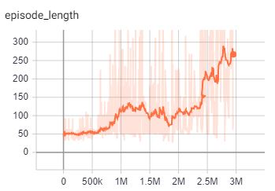

# hack-flappy-bird-drl
Training a DRL agent to play Flappy Bird. An exercise to reimplement DQN, Policy Gradient, and A3C DRL methods.

## Dependencies
- Python
- pyTorch
- pygame
- NumPy

## To Run
Modify the `config/dqn.py` file with your desired parameters. Then you can go ahead and start by going back to the project root directory and running `python dqn.py`

## Notes on DQN
I made a few changes to the original paper:
- I only optimized one network (instead of having separate policy and target networks) just to simplify the overall workflow (inspired by nevenp's repo). 
- I replaced RMSProp with Adam optimizer.
- Also, to select random actions, I gave higher weight to the "do nothing" action since that action is used quite a bit more often than the "flap" action (inspired by xmfbit's repo).

## Results

Results for DQN.

I had to stop/resume training a couple times, which is why the training curve isn't completely smooth. This could probably be fixed if you saved off your optimizer in addition to your network weights! As you can see, the length (in frames) of a playing episode increases as flappy learns good strategies.

Here's a video of some game play :)

## References
- DQN: 
    - Paper: https://deepmind.com/research/publications/human-level-control-through-deep-reinforcement-learning/
    - PyTorch tutorial: https://pytorch.org/tutorials/intermediate/reinforcement_q_learning.html
    - nevenp's blog post: https://www.toptal.com/deep-learning/pytorch-reinforcement-learning-tutorial

- A3C: 
    - Paper: https://arxiv.org/pdf/1602.01783v1.pdf
    - MorvanZhou's implementation: https://github.com/MorvanZhou/pytorch-A3C
    
- TRPO/PPO