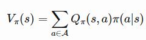

# hack-flappy-bird-drl 
Training a DRL agent to play Flappy Bird. Includes implementations of DQN, A3C, and PPO methods.

| DQN  | A3C | PPO |
|:------------: |:---------------: |:---------------:|
| | [WIP] | [WIP] |


## ⚙️ Running the code

Replace `dqn` in the steps above with `a3c` or `ppo` to train/evaluate on those networks. 

```sh
# Install the requirements
# pytorch, pygame, numpy, tensorboardX

# To train
vi config.py  # Set MODE = 'train'
python dqn.py

# Have flappy bird play a game on its own
vi config.py  # Set MODE = 'eval'
python dqn.py

# You can visualize your results via TensorBoard
# Replace EXPERIMENT_NAME with the corresponding field in your config file.
tensorboard --logdir <EXPERIMENT_NAME>
```

## 📌 Deep Q-Networks (DQN)

An agent in state *s ∈ S* takes an action *a ∈ A* which moves it into another state *s'*. The environment gives a reward *r ∈ R* as feedback; the mechanism for which an agent chooses an action in a state *s* is known as its policy *π(a|s)*. At a given time step *t*, the agent aims to take an action s.t. it maximizes its future reward *R<sub>t</sub> = r<sub>t</sub> + γr<sub>t+1</sub> + γ<sup>2</sup>r<sub>t+2</sub> + ... + + γ<sup>n-t</sup>r<sub>n</sub> = r<sub>t</sub> + γR<sub>t+1</sub>*. Here, *γ* is a discount factor which adjusts for the fact that future predictions tend to be less reliable. 

The Q-value is a function which represents the maximum future reward when the agent performs an action *a* in state *s*, *Q(s<sub>t</sub>,a<sub>t</sub>)= max R<sub>t+1</sub>*. The estimation of future reward is given by the Bellman equation *Q(s,a) = r + γ max<sub>a'</sub> Q(s',a')*.

As you can probably tell, for large state-action spaces, learning this giant table of Q-values can quickly become computationally infeasible. In deep Q-learning, we use neural networks to approximate q-values *Q(s,a; θ)* (where *θ* are the network parameters). There are some added tricks to stabilize learning:
- **Experience replay**: We store episode steps (*s, a, r, s'*) aka "experiences" into a replay memory. Minibatches of these experiences are later sampled during training. Not only does experience replay improve data efficiency, it also breaks up strong correlations which would occur if we used consecutive samples, reducing the variance of each update.
- **Epsilon-greedy exploration**: With a probability *ε* we take a random action, otherwise take the optimal predicted action. *ε* is decayed over the number of training episodes. This strategy helps tackle the exporation vs. exploitation dilemma.

During training, we optimize over the MSE loss of the temporal difference error *(Q(s,a;θ) - (r(s,a) + γ max<sub>a</sub> Q(s',a;θ)))<sup>2</sup>*

In flappy bird, our action space is either "flap" or "do nothing", our state space is a stack of four consecutive frames, and our reward is driven by keeping alive (+0.1) or passing through a pipe pair (+1).

## 📌 Asynchronous Advantage Actor Critic (A3C)

The 3 A's of A3C:

- **Advantage**: We learned about Q-values in the previous section. The state-value *V(s)* can be thought of the measure of the "goodness" of a certain state and can be recovered from the Q-values and the policy . The difference between the Q-value and V is known as the advantage, which captures how much better and action is compared to others at a given state. Because our network is not computing Q values directly, we can approximate Q with the discounted reward R. A = *Q(s,a) - V(s) ~ R - V(s)*.
- **Actor-Critic**: We have two types of learners, the actor and the critic, which manifest as two separate fully-connected layers on top of a base network. The actor learns the policy *π(a|s;θ)*, outputting the best action probabilities given its current state. The critic learns the state-value function *V(s;w)*-- it can therefore evaluate the actor's suggested action and guide the actor's training updates. 
- **Asynchronous**: There are multiple workers who each have their own local AC networks. Each of these workers interacts with it's own copy of the environment and contributes to updating a shared global AC network's parameters, as well as periodically synchronizing with the global network. Not only does this accelerate training, but the independent agent experiences also results in more diverse training. 


## 📌 Proximal Policy Optimization (PPO) 

## 📈 Results

*DQN*

I had to stop/resume training a couple times, which is why the training curve isn't completely smooth. This could probably be fixed if you saved off your optimizer in addition to your network weights! As you can see, the length (in frames) of a playing episode increases as flappy learns good strategies.


*A3C*

[In progress.]

*PPO*

[Not started yet.]

## 📖 References
- DQN: 
    - Paper: https://deepmind.com/research/publications/human-level-control-through-deep-reinforcement-learning
    - PyTorch tutorial: https://pytorch.org/tutorials/intermediate/reinforcement_q_learning.html
    - Toptal blog post: https://www.toptal.com/deep-learning/pytorch-reinforcement-learning-tutorial

- A3C: 
    - Paper: https://arxiv.org/pdf/1602.01783v1.pdf
    - MorvanZhou's implementation: https://github.com/MorvanZhou/pytorch-A3C
    - Arthur Juliani's blog post: https://medium.com/emergent-future/simple-reinforcement-learning-with-tensorflow-part-8-asynchronous-actor-critic-agents-a3c-c88f72a5e9f2
    
- PPO
    - Paper:
